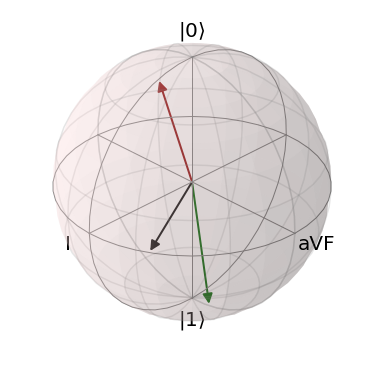
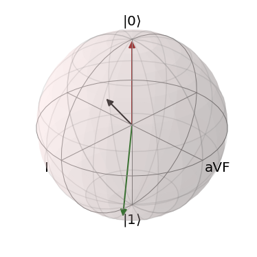
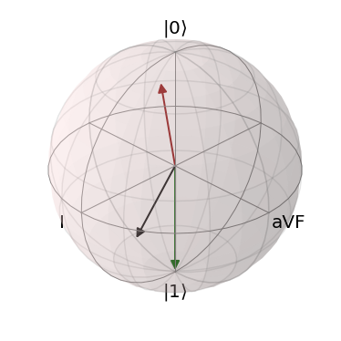
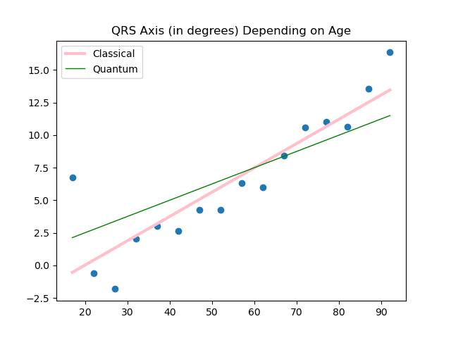

# Mean Axis Calculation on Qauntum Hardware. Prototype Phase.
QRS axis is one of key characteristics of electrocardiogram. Its evaluation or calculation can be performed in several ways the most precise is based on hexaxial reference (Cabrera) system. Here we use a Novosel formula that processes two ECG leads, bipolar I and unipolar aVF. Their orthogonality to each other makes the procedure more easier so only RX and RY gates would be involved to create a basis for measurements. Another one simplification is using only voltage extrema without any summing. Their difference equals to signal amplitude that marks on circle of axes. We encode magnitudes as vector projections on equatorial plane when mapping on Bloch sphere. It is equal to inclination in small-angle approximation which is possible for scale factor 1e-04. Note we use standart positive counterclokwise rotation instead of the clockwise one in a Cabrera system. If red and green vectors are near |0> and |1> respectively the direction we are looking for is a bisector of the vectors that is close to XOY phase plane. It also corresponds to a maximal sum probability of relevant measurements in non-orthogonal basis {I, aVF}.

The algorithm is implemented in Qiskit using noise-free statevector simulator. Data is taken from open access database on Kaggle. The files we chose can be handled without any prerocessing such as noise reduction.

# Linear Regression Model on DWave Qauntum Annealers. Prototype Phase.

The Team has implemented a linear regression model as descibed in *Adiabatic quantum linear regression* research paper by P. Date and T. Protok. The code implementation is similar to the classical ML frameworks. However, the loss-function optimization has been adopted and implemented in such a way that it could be submitted to DWave Quantum Annealers. The Qauntum Annealer minimizes the loss and returns a distribution of possible linear regressions. We tested our ptototype as the Simulated Annealing only due to the lack of an access to DWave's Quantum Hardware.  

Our Addiabatic Linear Regression model is used in a similar way as its counterparts avaliable in Scikit-learn framework. 

The following line initializes the model as Addiabatic Linear Regression:

    addiabatic_lin_model = QALinearRegression()

To train the model, run:

    addiabatic_lin_model.train(x, y)

Finally, to make prediction:

    predicted_data = addiabatic_lin_model.predict(x)

We also implemented the metrics such as MAE, RMAE, and MSE. 

Given the probabilistic nature of Qauntum Annealers, we have to controll an exta parameter defined as "precision vector" and described in the research paper by P. Date and T. Protok. 

# Medical Data 
To test the calculation of mean axis on IBM Qauntum computer and train Addiabatic Linear Regression, we used database that stores 10,000 patients ECGs records in form of the .csv files. The description of the dataset could be found [here](https://figshare.com/collections/ChapmanECG/4560497/2). 

We used ECGs data to extract the information about the I and III leads using Scipy Python framework for the signal processing. 

For the Addiabatic Linear Regression training, we used to filter the database to collect the data about healthy heart functioning. This data was later devided into age groups, and the data in each age group was averaged. We exclude the patients who are younder that 15 years. We took the similar approach in data preparation as described in the article *Combined Effects of Age and Comorbidities on Electrocardiographic Parameters in a Large Non-Selected Population*. 

Since many characteristics of a human heart has non-linear properties, we selected only those that posses strong linear patterns such as the depenecy of QRS Axis, QRS Duration and QTc duration from age of patients. 

# Mean QRS Axis Prediction on Qauntum Hardware. Prototype Phase.
The results of training for QRS Axis (in degrees) prediction dependin on age is depicted on the graph below. 

# Mean QRS Duration Prediction on Qauntum Hardware. Prototype Phase.
[Work In Progress]
# Mean QTc Duration Prediction on Qauntum Hardware. Prototype Phase.
[Work In Progress]

# References.
1. Date, P., Potok, T. Adiabatic quantum linear regression. Sci Rep 11, 21905 (2021). https://doi.org/10.1038/s41598-021-01445-6
2. Giovanardi, P.; Vernia, C.; Tincani, E.; Giberti, C.; Silipo, F.; Fabbo, A. Combined Effects of Age and Comorbidities on Electrocardiographic Parameters in a Large Non-Selected Population. J. Clin. Med. 2022, 11, 3737. https://doi.org/10.3390/jcm11133737 
3. Zheng, Jianwei; Rakovski, Cyril; Danioko, Sidy; Zhang, Jianming; Yao, Hai; Hangyuan, Guo (2019): A 12-lead electrocardiogram database for arrhythmia research covering more than 10,000 patients. figshare. Collection. https://doi.org/10.6084/m9.figshare.c.4560497
4. Dahl, R., Berg R. Trigonometry of the ECG. https://doi.org/10.36866/pn.120.25
5. Electrocardiography (ECG) Signals Database. https://www.kaggle.com/datasets/scipygaurav/electrocardiography-ecg-signals-database
