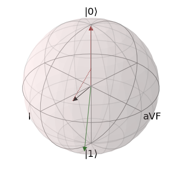

# Overview
The repository containes the work done during the [Quantum Science and Technology Hackathon 2022](https://quantum-science-and-technology-hackathon-2022.hackerearth.com/) under the category of *Life Sceinces* and won the third place.

Theme: Compute the mean electric axis of the heart on IBM quantum hardaware. Make the heart axis prediction using the DWave Quantum Annealers.

## Technology Used
1. IBM Quantum, [IBM Qiskit](https://qiskit.org/)
2. Dwave Simulated Annealing, [Ocean SDK](https://docs.ocean.dwavesys.com/en/stable/)

# Mean Axis Calculation on Quantum Hardware. Prototype Phase.
QRS axis is one of key characteristics of electrocardiogram. Its evaluation or calculation can be performed in several ways the most precise is based on hexaxial reference (Cabrera) system. We use a Novosel formula taken from *Trigonometry of the ECG: A formula for the mean electrical axis of the heart* by Dahl and Berg. It processes two ECG leads, bipolar I and unipolar aVF. Their orthogonality to each other makes the procedure more easier so only RX and RY gates would be involved to create a basis for measurements. Another one simplification is using only voltage extrema without any summing. Their difference equals to signal amplitude that marks on circle of axes. We encode magnitudes as vector projections on equatorial plane when mapping on Bloch sphere. It is equal to inclination in small-angle approximation which is possible for scale factor 1e-04. Note that we use standart positive counterclokwise rotation instead of the clockwise one in a Cabrera system. If I and aVF vectors are near |0> and |1> respectively the direction we are looking for is a bisector of the vectors that is close to XOY phase plane. It also corresponds to a maximal sum probability of relevant measurements in non-orthogonal basis {I, aVF}.

The algorithm is implemented in Qiskit using noise-free statevector simulator. Data is taken from open access database on Kaggle. The dataset can be found [here](https://www.kaggle.com/datasets/scipygaurav/electrocardiography-ecg-signals-database) or in the  subdirectory. The database containes noise free signals, so there are no need to run noise reducing algorithms.

## Installation

For a local installation, ideally in a virtual environment, run:

    pip install -r requirements.txt

## How To

The Qiskit code implementation for the heart axis calculation is avaliable in python class in ``quantum_heart_class.py``  file. 
To run the calculations, initialize the <QuantumHeart> class and call the ``get_qrs_axis()`` method of the class:

    qrs_axis = QuantumHeart()
    qrs_angle = qrs_axis.get_qrs_axis(ECG_I, ECG_aVF)

To run the entire experiemnt for the heart axis calculation on IBM quantum device, run 

    python3  main_for_axis.py

# Linear Regression Model on DWave Quantum Annealers. Prototype Phase.

The Team has implemented a linear regression model as descibed in *Adiabatic quantum linear regression* research paper by P. Date and T. Protok. The code implementation is similar to the classical ML frameworks. However, the loss-function optimization has been adopted and implemented in such a way that it could be submitted to DWave Quantum Annealers. The Quantum Annealer minimizes the loss and returns a distribution of possible linear regressions. We tested our ptototype as the Simulated Annealing only, due to the lack of an access to DWave's Quantum Hardware.  

The Addiabatic Linear Regression model is used in a similar way as its counterparts avaliable in Scikit-learn framework. The code implementation is avaliable in ``annealing_lin_regression.py``, ``annealing_optimizer.py`` files in ``linear`` subdirectory.

## How To

The following line initializes the model as Addiabatic Linear Regression:

    addiabatic_lin_model = QALinearRegression()

To train the model, run:

    addiabatic_lin_model.train(x, y)

Finally, to make prediction:

    predicted_data = addiabatic_lin_model.predict(x)

We also implemented the metrics such as MAE, RMAE, and MSE. 

*Note:* Given the probabilistic nature of Quantum Annealers, we have to controll an exta parameter defined as "precision vector" and described in the research paper by P. Date and T. Protok. 

All steps are compossed in ``main_for_lin_regr.py`` file. To obtain the results of the Quantum Linear Regression, simple execute the code in ``main_for_lin_regr.py`` file:

    python3  main_for_lin_regr.py

# Medical Data 
To train Addiabatic Linear Regression, we used database that stores 10,000 patients ECGs records in form of the .csv files. The description of the dataset could be found [here](https://figshare.com/collections/ChapmanECG/4560497/2). 

We used ECGs data to extract the information about the I and III leads using Scipy Python framework for the signal processing. 

For the Addiabatic Linear Regression training, we used to filter the database to collect the data about healthy heart functioning. This data was later devided into age groups, and the data in each age group was averaged. We exclude the patients who are younder that 15 years since their data are highly unlinear. We took the similar approach in data preparation as described in the article *Combined Effects of Age and Comorbidities on Electrocardiographic Parameters in a Large Non-Selected Population*. 

Since many characteristics of a human heart has non-linear properties, we selected only the data that posses strong linear patterns such as the depenecy of QRS Axix from age of patients. 

# Mean QRS Axis Prediction on Quantum Hardware. Prototype Phase.

The results of training for QRS Axis (in degrees) prediction depending on age is depicted on the graph below. 

We used the data from other data set avaliable [here](dataset/axis_calculation) to evaluate the model. The data was proccessed in a similar way as for the model training. 

Linear Regressions Training Metrics.
        
    R^2 of the Adiabatic Linear Regression is 0.8898309926203356.

    R^2 of the Sklearn Linear Regression is 0.94383692314776.

Linear Regressions Evaluation Metrics.

    MAE of the Adiabatic Linear Regression is 7.581347240389968.

    MSE of the Adiabatic Linear Regression is  229.90730391747437.

    Root MSE of the Adiabatic Linear Regression is  15.162694480779937.
        
    R^2 of the Adiabatic Linear Regression is 0.4043312141285681.

    R^2 of the Sklearn Linear Regression is 0.14291769531049192.

# Authors
1. [Elena Suraeva, PhD](https://github.com/elenasuraeva)
2. [Olga Okrut](https://github.com/olgOk)

# License
This work is licensed under the [Apache 2 License](https://www.apache.org/licenses/LICENSE-2.0) and is owned by [Elena Suraeve](https://github.com/elenasuraeva) and [Olga Okrut](https://github.com/olgOk) 

# References.
1. Date, P., Potok, T. Adiabatic quantum linear regression. Sci Rep 11, 21905 (2021). https://doi.org/10.1038/s41598-021-01445-6
2. Giovanardi, P.; Vernia, C.; Tincani, E.; Giberti, C.; Silipo, F.; Fabbo, A. Combined Effects of Age and Comorbidities on Electrocardiographic Parameters in a Large Non-Selected Population. J. Clin. Med. 2022, 11, 3737. https://doi.org/10.3390/jcm11133737 
3. Zheng, Jianwei; Rakovski, Cyril; Danioko, Sidy; Zhang, Jianming; Yao, Hai; Hangyuan, Guo (2019): A 12-lead electrocardiogram database for arrhythmia research covering more than 10,000 patients. figshare. Collection. https://doi.org/10.6084/m9.figshare.c.4560497 
4. Dahl, R., Berg, R. Trigonometry of the ECG: A formula for the mean electrical axis of the heart. Physiology News Magazine, Issue 120, (2022). https://doi.org/10.36866/pn.120.25.
